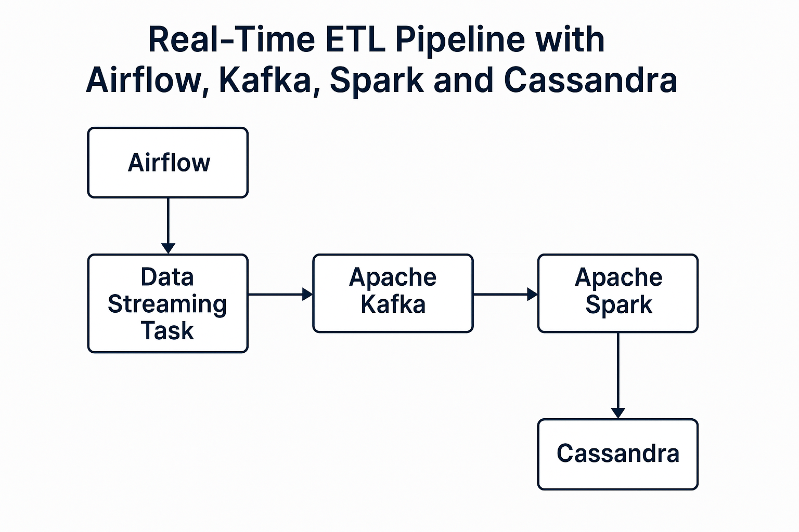

# Real-Time ETL Pipeline with Airflow, Kafka, Spark and Cassandra

Author: [Cleber Zumba](https://github.com/cleberzumba)

Last Updated: June 18, 2025





This project implements a real-time ETL architecture using the following technologies:

* **Apache Airflow**: Workflow orchestration and pipeline scheduling.
* **Apache Kafka**: Streaming platform for ingesting real-time data.
* **Apache Spark (PySpark)**: Distributed processing of streaming data.
* **Apache Cassandra**: NoSQL database for scalable and high-performance storage.

---

## 🚀 Architecture Overview

The data pipeline works as follows:

1. **Airflow** triggers the data streaming job.
2. A Python script simulates data ingestion from an API and sends it to **Kafka**.
3. **Spark Structured Streaming** consumes the data from Kafka, applies transformations and filtering.
4. The processed data is saved into a **Cassandra** database.
5. All components are containerized using **Docker Compose**.

---

## 📦 Technologies

* Python 3.11
* Apache Airflow 2.10.4
* Apache Kafka 3.9.0
* Apache Spark 3.5.4 (PySpark)
* Apache Cassandra 5.0.2
* Docker & Docker Compose

---

## 📁 Project Structure

```
.
├── client/
│   ├── Dockerfile                    # Container image for Spark consumer
│   ├── LEIAME.txt
│   └── consumer_stream.py           # Spark consumer that writes to Cassandra
├── server/
│   ├── LEIAME.txt
│   ├── dags/                        # Airflow DAGs
│   ├── docker-compose.yml          # Multi-service container orchestration
│   ├── entrypoint/                 # Entrypoint script for Airflow
│   └── requirements.txt            # Python dependencies
```

---

## 🧪 Running the Pipeline

1. Start all containers:

```bash
cd server
docker compose up -d --build
```

2. Access the Airflow UI:

```
http://localhost:8080
```

3. Trigger the DAG: `real-time-etl-stack`

4. Check Cassandra for data persistence:

```bash
docker exec -it cassandra cqlsh
USE dados_usuarios;
SELECT * FROM tb_usuarios;
```

---

## ✅ Expected Output

Structured user data will be stored in `tb_usuarios` table on Cassandra after being processed in real time via Kafka and Spark.

---

## 📌 Future Improvements

* Add monitoring with Prometheus + Grafana.
* Add a REST API to expose the results.
* Include tests and alerting mechanisms.

---

## 🧑‍💻 Author

Cleber – Data Engineer & Distributed Systems.
